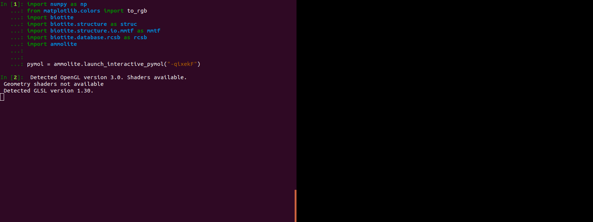

#############
biotite2pymol
#############

This package enables the transfer of structure related objects
from `Biotite <https://www.biotite-python.org/>`_
to `PyMOL <https://pymol.org/>`_ for visualization,
via PyMOL's Python API:

- Import :class:`AtomArray` and :class:`AtomArrayStack` objects into *PyMOL* -
  without intermediate structure files.
- Convert *PyMOL* objects into :class:`AtomArray` and :class:`AtomArrayStack`
  instances.
- Use *Biotite*'s boolean masks for atom selection in *PyMOL*.

|

|

Installation
------------

Usage
-----

API Reference
-------------

